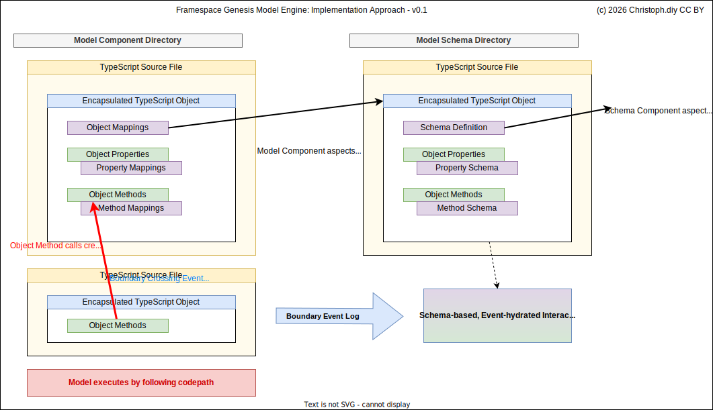

⚠️ **WARNING:** This repository may get squashed and force-pushed if the [GordianOpenIntegrity](https://github.com/Stream44/t44-blockchaincommons.com) implementation must change in incompatible ways. Keep your diffs until the **GordianOpenIntegrity** system is stable.

🔷 **Open Development Project:** The implementation is a preview release for community feedback.

⚠️ **Disclaimer:** Under active development. Code has not been audited, APIs and interfaces are subject to change.

Framespace Genesis 
===

An *experimental* implementation of an [encapsulate](https://github.com/Stream44/encapsulate) based visual modeling engine. Models are constructed and events are generated by following an actual execution path through annotated code components.

Overview
===

Framespace Genesis is not an abstract modeling tool. It is a modeling engine where the model is real TypeScript code that actually executes.

You author **components** — encapsulated TypeScript objects with properties and methods — and wire them together through **action invocations** that form a promise chain. When the model runs, method calls between components produce an **event log** of every boundary crossing: every payload that leaves one component and enters another.

This event log, combined with a **schema** that maps components to visual elements, drives an interactive visualization. The visualization is not hand-drawn. It is generated from the execution trace. Change the code, re-run, and the visualization updates.

The engine is built on [encapsulate](https://github.com/Stream44/encapsulate) which wraps TypeScript objects and intercepts boundary crossings transparently. You write normal TypeScript. The runtime kernel observes it.

**What this enables:**
- Go from abstract model → concrete execution → visual representation in one system
- Model real-world flows (like credential exchanges, service interactions) as executable component graphs
- Observe data movement across component and space boundaries to identify exposure, correlation, and risk
- Transpose models directly onto actual system implementations — the components may map to real classes and services

> **This project thrives on your collaboration!**

Try creating a model for something you are interested in and share it!

Visualization Model
===

The visualization is organized into **quadrants** with column and row trees that define the spatial layout. **Nested spaces** act as logical domains — the same identified space is the same space across quadrants, not just a visual container.

Inside spaces, **components** are the core unit. A component has **properties** (state) and **actions** (executable methods). Components can have multiple actions and attributes that define their visual and functional identity.

**Action invocations** connect components. An action payload moves from action to action — internal or external, one-to-one or fan-out to multiple invocations. Payloads crossing component and space boundaries emit **boundary crossing events** which makes execution observation possible.

The primary rule: construct a **promise graph** through all action invocations that touches every attribute and ends up in a resolved state when the model has finished executing.

Implementation Approach
===

A model is authored as TypeScript source files in two directories: **Model Components** and **Model Schema**.

Each component is an **encapsulated TypeScript object** with properties, methods, and mappings. Component aspects (properties, methods) are mapped to schema components. Schema components may in turn map to higher-order schema components.

The model **executes by following the actual codepath** — object method calls create a promise chain. The [encapsulate](https://github.com/Stream44/encapsulate) abstraction emits **boundary crossing events** whenever payloads exit or enter components and when components act internally.

These events are collected into a **boundary event log**. The schema and event log together drive a **schema-based, event-hydrated interactive visualization** — the UI is not hand-drawn, it is generated from the execution trace against the model schema.

Provenance
===

 

Repository DID: `did:repo:e7b46f0978c2cc02461b480b99a6589a2b6fa888`

<table>
  <tr>
    <td><strong>Inception Mark</strong></td>
    <td></td>
    <td><strong>Current Mark</strong></td>
    <td></td>
    <td>Trust established using <a href="https://github.com/Stream44/t44-blockchaincommons.com">Stream44/t44-BlockchainCommons.com</a></td>
  </tr>
</table>

(c) 2026 [Christoph.diy](https://christoph.diy) • Code: [LGPL](LICENSE.txt) • Text: [GNU Free Documentation License](https://www.gnu.org/licenses/fdl-1.3.txt) • Created with [Stream44.Studio](https://Stream44.Studio)

### Contributing

All contributions must contain [Developer Certificates of Origin](https://github.com/Stream44/dco). To contribute, sign `DCO.md` once using `bun run sign-dco` and push branches to github using `bun run push` which will squash unsigned commits into a signed commit.
