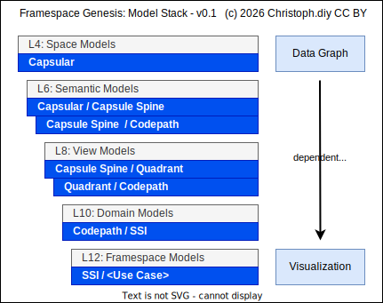

<table>
  <tr>
    <td><a href="https://Stream44.Studio"></a></td>
    <td><strong><a href="https://Stream44.Studio">Stream44 Studio</a></strong><br/>Open Development Project</td>
    <td>Preview release for community feedback.<br/>Get in touch on <a href="https://discord.gg/9eBcQXEJAN">discord</a>.</td>
    <td>Hand Designed<br/><b>AI Coded Alpha</a></td>
  </tr>
</table>

⚠️ **Disclaimer:** Under active development. Code has not been audited. APIs and interfaces are subject to change!

Framespace Genesis
===

Ontology-driven structural modeling tool for declaratively building multi-dimensional models with layered reactive functional data processing resulting in realtime interactive visualizations.

Usage
--

[bun.sh](https://bun.sh) is required.

After cloning run:

```
bun install

# Start the workbench
bun run dev

# Open browser
open http://localhost:3000

# Run tests (optional)
bun run test
```


Problem Statement
---

Semantic models are an indispensable tool for model-driven development and structuring context for AI.

Semantic modeling becomes a complex task when combining multiple models horizontally and vertically leading to slow progress in practical applications of comprehensive models.

Knowledge models require better tooling and toolchain integration to evolve into a well-understood and leveraged technology.


Innovation
---

Framespace Genesis uses a novel approach to create complex layered models by taking a code-first approach that feels familiar and is efficient to work with by hand and with AI.

Models are constructed as code components with declarative mappings to other components and executed by creating and resolving a promise chain across component method invocations. This is made possible by the [encapsulate](https://github.com/Stream44/encapsulate) library.

A code-first approach to building semantic entities allows for hoisting functional processing nodes into a graph and for the construction of dynamic graphs with very litte tooling. When the tools disappear and the abstraction is clear new possibilities arise.


Purpose
---

1. Explore model development using the [encapsulate](https://github.com/Stream44/encapsulate) approach and layered functional processing in a structured graph to discover sclable graph processing patterns.

2. Explore the creation of interactive visual interfaces driven exclusively by models.


Modeling Layers
---

Visual models running in the workbench are constructed by calling model APIs implemented in various lower layers.



### L3: Model Server

Exposes model APIs for querying data. In the process model layers are linked into reactive data processing graphs.

**Roadmap:**

- [x] initial engine and test structure
- [ ] tune engine data schemas for rapid querying

### L4: Space Models

Space models are modular & self-contained graph models with strict boundaries.

They are infinite data substrates constructed from simple repeating primitives.

- **Capsular**
 - A model that encodes component-based implementation architectures into capsule spines.
 - The schema is dictated by https://github.com/Stream44/encapsulate
 - Implementation details: [L4-space-models/Capsular/README.md](L4-space-models/Capsular/README.md) 

### L6: Semantic Models

Semantic models define dimensions in a space by structuring primitives into linked objects with specific properties.

- **Capsular / Capsule Spine**
 - Conveniently query *Spine Instance Trees*, *Capsule Source Trees* and *Membrane Events* in **Capsular** spaces.

### L8: View Models

View models structure one or more semantic models into derived layout visual canvases.

See [L8-view-models/README.md](L8-view-models/README.md) for details.

### L13: Workbench

The framespace workbench UI SPA implementation that connects to the **Model Server**.

**Roadmap:**

- [x] initial UI
- [ ] cleanup reps approach
- [ ] shift complete UI to model entity reps
- [ ] tune for 1k entity count

Provenance
===

[](https://github.com/Stream44/FramespaceGenesis/actions/workflows/gordian-open-integrity.yaml?query=branch%3Amain) [](https://github.com/Stream44/FramespaceGenesis/actions/workflows/dco.yaml?query=branch%3Amain)

Repository DID: `did:repo:e7b46f0978c2cc02461b480b99a6589a2b6fa888`

<table>
  <tr>
    <td><strong>Inception Mark</strong></td>
    <td></td>
    <td><strong>Current Mark</strong></td>
    <td></td>
    <td>Trust established using<br/><a href="https://github.com/Stream44/t44-blockchaincommons.com">Stream44/t44-BlockchainCommons.com</a></td>
  </tr>
</table>

(c) 2026 [Christoph.diy](https://christoph.diy) • Code: [LGPL](./LICENSE.txt) • Text: [CC BY-SA 4.0](https://creativecommons.org/licenses/by-sa/4.0/) • Created with [Stream44.Studio](https://Stream44.Studio)
